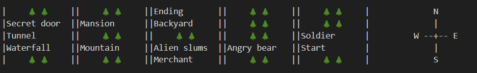

# RPG Game Summary

This is a Cli text-based RPG game developed using Java, where the player explores a mysterious world, battles enemies, collects items, and navigates a variety of challenges. The game incorporates various elements such as map navigation, random events, inventory, and an engaging storyline that unfolds through character interactions and has multiple endings.


## Table of Contents
- [Game Background](#background)
- [Objective](#objective)
- [Characters](#main-characters)
- [Map](#map)
- [Features](#features)
- [Development](#development)
- [Task Allocations](#task-allocations)
- [References](#references)


## Background

The game begins with you on another journey to find the quietest place to swim deep within the unknown parts of space. All of a sudden a warning pops up. A scheduled, forced software update which goes horribly wrong. As you scramble to avoid disaster, your ship is forced to make an emergency landing on a random planet close by. After a safe automated landing, the ships reception disconnects from the server and you have to attach your external antenna to the ship for the update to proceed. You finally manage to pop in the antenna but when you think you’re back in control, Chris Hanson, bird-like creature, swoops in and steals the antenna right before he mocks you.

Since you had made your emergency landing in someone's farm. An ugly man approaches you. Stunning you with his breath and ugliness. He also gives you a map that points to where that birdlike creature lies, next to his master Blarbazorp. Your journey to recover the antenna and find your way home begins. Along the way, you’ll uncover the planet's tragic history and decide whether to help its inhabitants or focus solely on your escape.


## Objective
Although this story starts in mid space most of it takes place on an eccentric, forsaken planet deep in the galaxy. Once a bustling hub of trade and technology, now a chaotic wasteland. The once-thriving society has crumbled, largely due to the actions of a ruthless overlord, Blarbazop, who steals and hoards everyone's resources with the assistance of his pet/henchman Chris Hansen a mischievous bird-like creature who causes trouble for everyone—especially you, the player.

The planet’s landscape is as bizarre as its inhabitants. Alien slums litter the surface, where creatures scrape by, selling oddities in decrepit markets. Majestic but deteriorating, mountains loom in the distance, covering ruins of the planet’s former glory. In the heart of this planet stands Blarbazop’s mansion, a fortress of wealth where he holds his stolen treasure. So that's where you as the main player will be heading to. To take back whats yours.


## Main Characters

**The Protagonist (Player Character):** You are a space traveler who gets stranded on a forsaken planet. With a sarcastic and sharp-tongued personality, you navigate this absurd planet in search of your stolen antenna. Your main goal is to fix your ship and get off the planet, but along the way, you’ll encounter unexpected challenges and opportunities.

**Chris Hanson (The Bird Thief):** Introduced initially as Jock Bird, Chris Hanson is a winged creature who taunts and steals from anyone and everyone. Though seemingly mischievous, he is far more than just a petty thief. He's Blarbazop's henchman, Chris plays a pivotal role in keeping the planet’s residents poor and miserable. His snide comments and unpredictable behavior make him a constant thorn in your side.

**Blarbazop (The Boss):** The ultimate antagonist, Blarbazop is an evil and greedy overlord who rules the planet with an iron fist. Through his manipulation and hoarding, he has thrown the entire planet into ruin, keeping its inhabitants weak and desperate. He hides away in his mansion, surrounded by wealth and power, while the rest of the planet crumbles. He has something that belongs to you. Blarbazop’s downfall becomes not just your mission to escape, but the key to liberating the planet.

**Ugly Man:** A local alien farmer with a face that’s, well, hard to look at. Despite his appearance and bad breath, Ugly Man is one of the friendliest and most helpful characters you meet. After some really bad directions he actually gives you a map that leads you to Blarbazop's mansion.


## Map




## Features

- **Map Navigation**: The player can explore the map using directional inputs (n: north, e: east, s: south, w: west).
- **Combat System**: Engage in combat with various enemies, using attack, sneak, and item options. Combat is turn-based with some enemies being more powerful than others.
- **Inventory System**: The player can acquire items during their journey and use them in combat or trade them with merchants.
- **Random Events**: Sneak attempts, are randomly determined, adding an element of chance to the game.
- **Text-Based Interaction**: The game simulates dialogue and descriptions using a delay-based text output (`DPO`), providing a more immersive storytelling experience.


## How to Play

### Prerequisites
Before running the game, ensure the following are installed on your system:
- **Java Development Kit (JDK)**  
  You can download the latest version of the JDK [here](https://www.oracle.com/java/technologies/javase-downloads.html).
- **A terminal or command line interface** (for running commands)

**Clone or download the project:**
   - If using Git, run the following command in your terminal:
     ```bash
     git clone https://github.com/your-repository/game-project.git
     ```
   - Alternatively, download the ZIP file from the repository and extract it.

1. **Starting the Game**: Use play button to run code, the player will be asked to enter their name to create their character.
2. **Moving Around the Map**: Use `n`, `e`, `s`, `w` commands to navigate the game world. The game will notify you of your current location.
3. **Combat**: When encountering enemies, you'll have options to attack, sneak, or use an item from your inventory. Combat is turn-based.
4. **Interacting with NPCs**: You can trade with merchants and engage in story-driven dialogue with other characters.
5. **Game Menu**: Press `1` at any time to open the game menu and access the map or inventory.


## Development

**Difficulties of Arvin:**
Of course, I had a rough idea of what my code needed for the mapping system in this game. The challenges really started after I had written the basic class code with its getters and setters. I was aiming for something functional at first that I could build on later. But I did run into a few issues, and here's what they were and how overcame them:

Indexing Issues: I initially set the player's starting position at (0, 0), which landed them in the top-left corner—far from the actual starting point of the game. To fix it, I set the default starting position to (3, 4) so the player starts from next to the bottom-right corner where "Start" was planned to be.

Movement Challenges: The movement mechanics were tricky. At first, I had a hard time keeping the player from moving out of bounds or into empty spaces. I solved it by adding two checks: one to make sure the input was a valid direction, and another to ensure the player stays within the grid and doesn't walk into obstacles.

Marking Player's Position: Initially, the only way the player knew their position was from a printout of the location's name, and it wasn't clear enough. So, I added a condition to mark their position with an "X", ensuring it wouldn’t mess up the rest of the grid display.

Filling Empty Spaces: I started by using a simple "-" to represent empty spaces, but it didn’t look right to me. After some quick research, I remembered I could use emojis in code, so I went with the tree emoji 🌲 to make it visually clear which areas were unwalkable.

Compass Alignment: Aligning the compass with the map rows took a bit of trial and error. I eventually figured it out by integrating the compass printing into the iteration method that prints the map line by line.
 

Collabiration: Working with my coleagues was great as we communicated and voted for ideas building the game. The incorporation of the code into the main file was difficult specially since a lot of the other functions also relied on it. I had to write the plyrMove,gameMenu function so the user could choose to move or access the map and inventory, I tinkered with the welcome function, I renamed and separated the startGame into startgame and intro so i could call them separately and also trounleshoot later if needed. The back and forth was difficult as we all troubleshooted our code and tied everything in together.


**Difficulties of Nikki:**
I wanted the combat mechanics to have 3 functions, attack, sneak, and use item. I originally intended for special attacks, however I was unsure of where it would fit into the story, so I scrapped it. So it left me with this skeleton code structure:
if player picks 1:
fight sequence happens, player damages enemy
if player picks 2:
1/3 chance of sneaking away
if player picks 3:
choose from an inventory of items (if possible) to use
it becomes enemy's turn and vice versa

Attack Mechanism Issues:
I wanted to allow for certain aliens to have different attack times, to spice up the gameplay a bit. I originally branched off and added a seperate attackTime variable  within the Alien subclass, however, since the combat mechanism used the parent class Character as a parameter, I figured it would be easier to derive the attackTime variable from setting it to turnsToAttack in the initial stage. I fiddled around before settling that the AttackTime should be declared in the combat code, before any fight sequence has happened to ensure that the variable does not change. 

Debugging issues:
I wanted to ensure that anyone who tried to input something other than the numbers specified would still be able to run the combat sequence, in case of a mistype. So I surrounded by code with try: catch. However, I found that the while loop did not work as intended, as I originally had the while loop inside the try sequence. I was able to fix it by putting the while loop first. 

Sneak Chance challenges:
I wanted to introduce a certain random percentage that activates when you try to use the sneak function. So I thought of using the random number generator to achieve this. The random number generator picks a number from 1-3, and if that number lands on 1, then you have successfully snuck away.

Main function challenges:
It was mainly hard to figure out the right pacing for the game, although I don't believe it is perfect. I think it is playable with this text pacing. I wanted the text to slowly print out characters, like the ones you see in actual story games. So I figured out a way to slowly print out characters by writing the DPO function, which takes in the string input and outputs it by the specified amount of milliseconds in the function. I accomplished this by utilising the sleep function in Java. I also used that same function to provide spacing between dialogues.

As I was writing my code, I noticed that I was using the text box too often, so I figured i might as well write a function for it. This was not too hard to do, as I didn't really think about the logic behind it, more so got the result through trial and error. But essentially I got the function to return a framed word through slowly constructing the String with for loops. 

The rest of the code, mainly consisting of dialogue and descriptions, wasn't that hard to implement. I added the dialogue options and little comments of where my groupmates should add in their functions after a certain dialogue is pressed (such as 1 - climb mountain). So it mainly consisted of copying and pasting the text that we agreed upon in one of our group meetings.


**Difficulties of Minh:**
I aimed to make 


## Task allocations

**Storyline and dialogue -** Arvin, Minh, Nikki
**Combat -** Nikki
**Merchant -** Minh
**Game Menu -** Arvin
**Main -** Nikki
**Stats display -** Minh
**Map -** Arvin
**Inventory -** Minh
**Readme.md -** Arvin
**Documentation -** Arvin, Minh, Nikki
**Visuals -** Nikki
**Refrences -** Arvin, Minh, Nikki

## References


Emojipedia. (n.d.) Evergreen Tree Emoji. Available at: https://emojipedia.org/evergreen-tree (Accessed: 8 October 2024).

Educative. (n.d.) How to generate random numbers in Java. Available at: https://www.educative.io/answers/how-to-generate-random-numbers-in-java (Accessed: 15 October 2024).